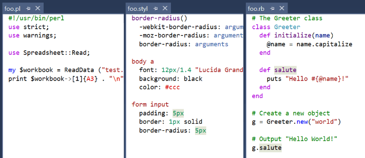

# Syntax Highlighting Pack

Download this extension from the [VS Gallery](https://visualstudiogallery.msdn.microsoft.com/d92fd742-bab3-4314-b866-50b871d679ee)
or get the [CI build](http://vsixgallery.com/extension/4773ce75-6f30-4269-9557-1f7c30a47be2/).

---------------------------------------

Adds syntax highlighting and snippet support for a wide variety of
programming languages such as Clojure, Go, Jade, Lua, Swift, Ruby and
many more...

See the [change log](CHANGELOG.md) for changes and road map.

  
*Showing Perl, Stylus and Ruby*

## TextMate bundles
This extension uses Visual Studio's capability to load TextMate bundles.

It works by registering TextMate bundles so that Visual Studio will
automatically load them when a file is opened that matches one of the
bundles and no other language service is available for the specific
file type.

For instance, this extension contains a TextMate bundle for YAML files,
but if you decide to install the more powerful
[YAML Editor extension](https://visualstudiogallery.msdn.microsoft.com/34423c06-f756-4721-8394-bc3d23b91ca7)
then that extension will win. That makes it safe to install this
extension even if you have separate extensions for one or more of the
languages already.

## Supported languages and file types

- Apache (.htaccess)
- Batch
- C++ QT
- Clojure
- CMake
- CSS
- Diff
- Dockerfile
- Elixir
- Erlang
- EYAML
- F#
- Git configs
- Go
- Gradle
- Groovy
- HAML
- Haskell
- ICalendar
- Ini
- Jade/Pug
- Java
- JavaDoc
- JavaScript
- JSON
- Lisp
- LaTeX
- Lua
- LESS
- Matlab
- Make
- Markdown
- Objective-C
- Pascal
- Perl
- PowerShell
- Protocol Buffer
- R
- Ruby
- Ruby on Rails
- Rust
- Scala
- Scheme
- ScriptCS
- Shaderlab
- ShellScript (Bash)
- SPARQL/Turtle
- SQL
- Stylus
- Swift
- TOML
- TypeScript
- YAML

## Unsupported langauges
The Textmate bundle support in Visual Studio 2015 doesn't support all languages. Here are some extensions that provide language support to some of these unsupported languages:

- **PHP** - [PHP Tools for Visual Studio](https://visualstudiogallery.msdn.microsoft.com/6eb51f05-ef01-4513-ac83-4c5f50c95fb5).
- **T4 (.tt)** - [Tangible T4 Editor](https://visualstudiogallery.msdn.microsoft.com/784cf592-b797-4d4d-ad33-331fcf63faad)

## Known issues
You need [Visual Studio 2015 Update 3](https://www.visualstudio.com/en-us/news/releasenotes/vs2015-update3-vs) for the Textmate bundles to work correctly. 

## File Icons
For the best experience, it is recommended that you also install the
free 
[File Icons extension](https://visualstudiogallery.msdn.microsoft.com/5e1762e8-a88b-417c-8467-6a65d771cc4e).

## Contribute
Feel free to suggest new languages not currently supported by this
extension on the
[issue tracker](https://github.com/madskristensen/TextmateBundleInstaller/issues).
If you know a TextMate bundle that would work, then remember to add a
link to that as well.

Check out the [contribution guidelines](.github/CONTRIBUTING.md)
if you want to contribute to this project.

For cloning and building this project yourself, make sure
to install the
[Extensibility Tools 2015](https://visualstudiogallery.msdn.microsoft.com/ab39a092-1343-46e2-b0f1-6a3f91155aa6)
extension for Visual Studio which enables some features
used by this project.

## License
[Apache 2.0](LICENSE)